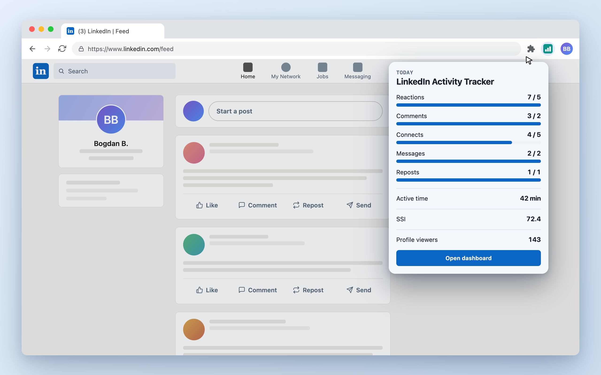
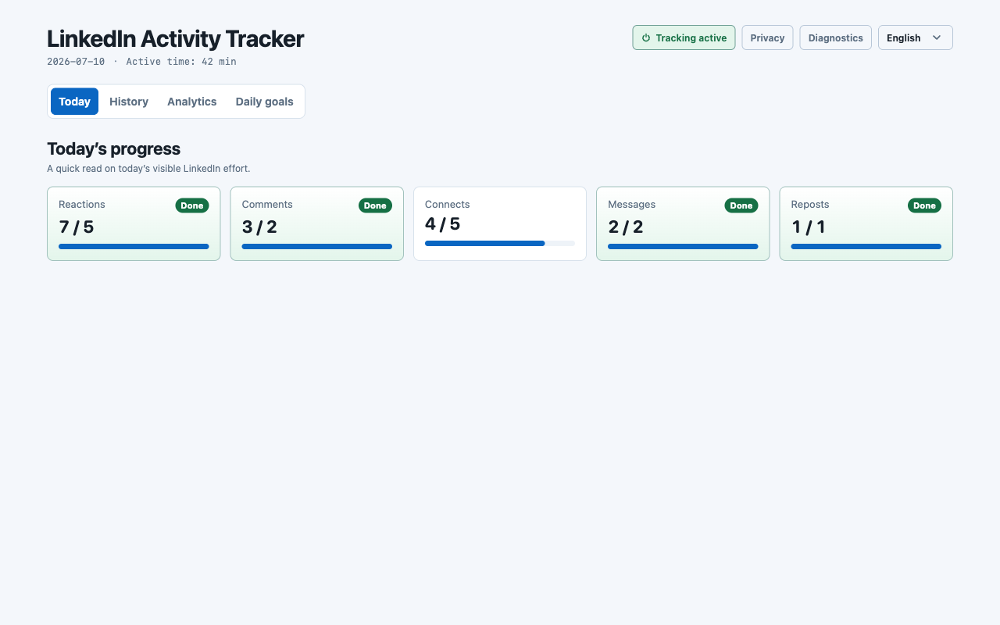
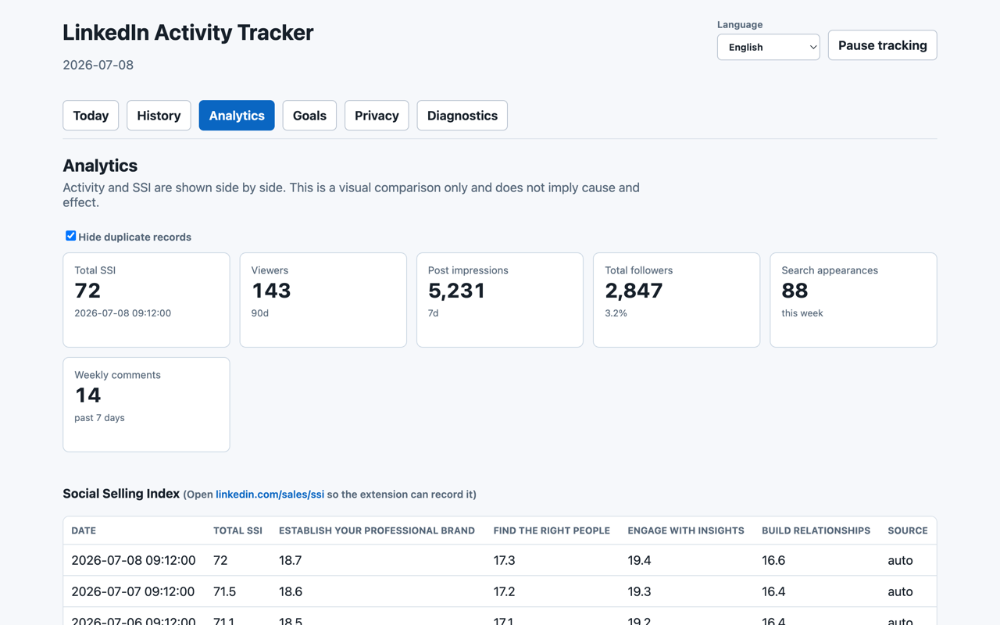
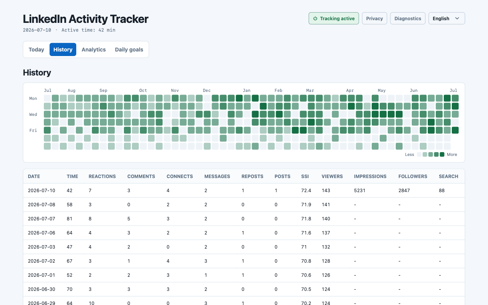

# LinkedIn Activity Tracker

Local-first Chrome extension for tracking your own LinkedIn activity.

It passively records the actions you perform yourself, keeps the data in your
browser, and helps you understand whether your LinkedIn routine is actually
moving.

<a href="https://chromewebstore.google.com/detail/linkedin-activity-tracker/gfnnloflkodejhnpbhpibhodclofpkkk"></a>



## Why This Exists

LinkedIn gives you scattered signals: reactions, comments, profile views, SSI,
dashboard impressions, follower counts, and search appearances all live in
different places.

LinkedIn Activity Tracker brings those signals into one local dashboard without
automating LinkedIn and without sending your data anywhere.

## Privacy First

This is the most important part of the project:

- Your activity data stays in your browser.
- Storage is local Chrome storage: `chrome.storage.local`.
- There is no backend account.
- There is no sync service.
- There is no analytics upload of your activity data.
- The extension never stores message, comment, or post text.
- The extension never stores cookies, tokens, emails, photos, or profile
  contents.
- The code is open source and can be inspected.

The extension observes LinkedIn pages in your browser. It does not click,
scroll, type, submit forms, send messages, or perform actions for you.

## What It Tracks

### Daily Activity

- Reactions
- Comments and replies
- Connection requests
- Messages
- Reposts
- Posts
- Active time on LinkedIn



### LinkedIn Analytics

The extension can also record aggregate metrics when you open the relevant
LinkedIn pages:

- Social Selling Index from `linkedin.com/sales/ssi`
- Profile viewers from `linkedin.com/analytics/profile-views`
- LinkedIn dashboard metrics from `linkedin.com/dashboard`
  - Post impressions
  - Total followers
  - Profile viewers
  - Search appearances
  - Weekly posts
  - Weekly comments

Only aggregate numbers are stored. Individual viewers, people, posts, and
private content are not stored.



## Features

- Local dashboard with daily progress and history
- Analytics tab for SSI, profile views, and LinkedIn dashboard snapshots
- Duplicate analytics entries can be hidden in the UI
- Goal tracking for daily activity
- Privacy toggles for optional metadata
- JSON export for your full local data
- CSV and Markdown exports for reporting
- Diagnostics for selector health when LinkedIn changes markup
- English and Russian UI
- 24-hour date/time display
- Branded in-page notifications so users know the feedback comes from the
  extension



## Install

Install the published extension from the Chrome Web Store:

<a href="https://chromewebstore.google.com/detail/linkedin-activity-tracker/gfnnloflkodejhnpbhpibhodclofpkkk"></a>

## Install From Source

1. Clone the repository:

   ```sh
   git clone https://github.com/bystritskiy/LinkedInActivityTracker.git
   cd LinkedInActivityTracker
   ```

2. Install dependencies:

   ```sh
   npm install
   ```

3. Build the extension:

   ```sh
   npm run build
   ```

4. Open Chrome Extensions:

   ```text
   chrome://extensions
   ```

5. Enable Developer mode.

6. Click **Load unpacked** and select the `dist/` folder.

After code changes, run `npm run build` again and click reload for the unpacked
extension in `chrome://extensions`.

## Usage

Use LinkedIn normally. The extension records supported actions after you perform
them yourself.

For aggregate analytics, open these LinkedIn pages manually:

- `linkedin.com/sales/ssi`
- `linkedin.com/analytics/profile-views`
- `linkedin.com/dashboard`

When the page renders the numbers, the extension records a local snapshot.

## Development

```sh
npm run build        # full production build into dist/
npm test             # run Vitest test suite
npm run typecheck    # TypeScript check
npm run dev:pages    # Vite dev server for popup/dashboard UI only
```

The extension is built as three bundles:

- `src/content/` -> content script for LinkedIn pages
- `src/background/` -> Manifest V3 service worker and storage writer
- `src/popup/` and `src/dashboard/` -> React UI pages

All writes go through the background worker. UI reads from
`chrome.storage.local` and subscribes to storage changes.

## Versioning

Patch version is bumped for every user-facing change.

Keep these versions in sync:

- `package.json`
- `package-lock.json`
- `public/manifest.json`
- `dist/manifest.json` after `npm run build`

## Project Status

This project depends on LinkedIn DOM markup, which changes over time. The
extension avoids brittle CSS selectors where possible and reports selector
health in Diagnostics, but occasional selector maintenance is expected.

## License

MIT

## Disclaimer

This project is not affiliated with LinkedIn. LinkedIn is a trademark of its
respective owner.
